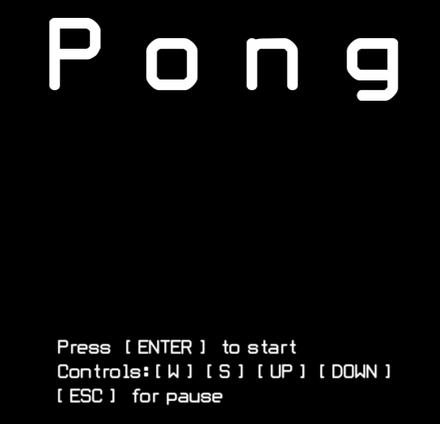
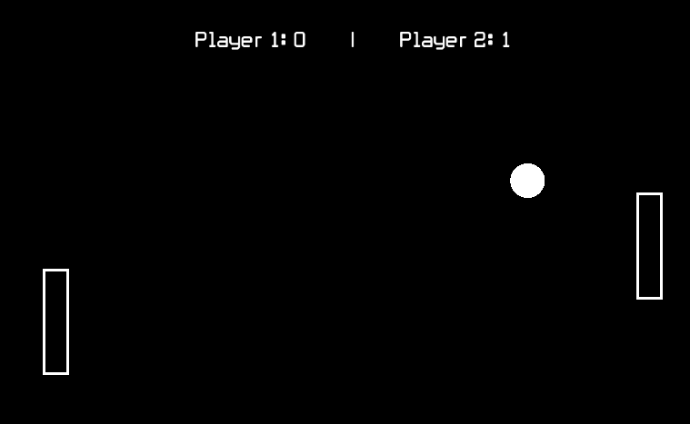
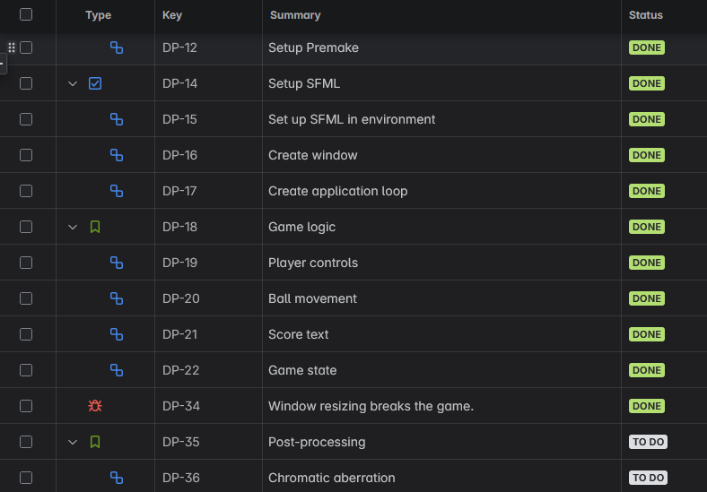

# Pong

My attempt at creating the pong game in C++.
Technologies:
-C++
-SFML
-Premake
-Git
-JIRA

## Building

**Only windows is supported at the moment.**

##### Step 1. Clone the repository:

`git clone git@github.com:Mokomaki/Pong.git`

or

`git clone https://github.com/Mokomaki/Pong.git`

##### Step 2. Run the build script:

The build script is found at:

`Pong/Scripts/Setup-Windows.bat`

After that you should have all nesseccary project and solution files and be able to build and run the project in visual studio 2022.

## Documentation

The development process has been documented on JIRA

